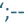

### **Hi there 👋**

```sh
    __  ____    ____          ___      __
   /  |/  / |  / / /___ _____/ (_)____/ /___ __   __
  / /|_/ /| | / / / __ \`/ __  / / ___/ / __ \`/ | /
 / /  / / | |/ / / /_/ / /_/ / (__  ) / /_/ /| |/ /
/_/  /_/  |___/_/\__,_/\__,_/_/____/_/\__,_/ |___/
**************** 4D 56 6C 61 64 69 73 6C 61 76 *****************
****************************************************************
* Copyright of MVladislav aka Wh1teP0ny, 2022                  *
* https://mvladislav.online                                    *
* https://github.com/MVladislav                                *
****************************************************************
* nice to see you here                                         *
****************************************************************
```

## With **❤️** to **☕** • IT👽Securiant • Pen😈Tester • Developer • ... • with **❤️** to Technology

- 🔭 I’m currently working on some smaller project to self learn
- 🌱 I’m currently learning eeeverything 🤪
- 🧑‍🎓 2022 Goals • Learn more and deeper in Prevention Methods
- ⚡ Fun fact: iwashere

┌──┤ **Where you can find more about me** ├─────────•••

[][hackthebox • profile]
[][hackthebox • academy • profile]
[][tryhackme • profile]
[][linkedin]
[][kit]
[][dockerhub]

</br>
</br>

[][hackthebox • profile]
[][tryhackme • profile]

</br>
</br>

└─────────────────────────────────•••

┌──┤ **Languages and Tools** ├─────────•••

<!-- [][mvladislav]
[][mvladislav]
[][mvladislav] -->

[][mvladislav]
[][mvladislav]
[][mvladislav]
[][mvladislav]
[][mvladislav]
[][mvladislav]

[][mvladislav]
[][mvladislav]
[][mvladislav]

[][mvladislav]
[][mvladislav]
[][mvladislav]

[][mvladislav]
[][mvladislav]

</br>
</br>

[][mvladislav]
[][mvladislav]
[][mvladislav]
[][mvladislav]
[][mvladislav]

</br>
</br>

[][mvladislav]
[][mvladislav]
[][mvladislav]

</br>
</br>

[][mvladislav]
[][mvladislav]
[][mvladislav]
[][mvladislav]
[][mvladislav]
[][mvladislav]
[][mvladislav]
[][mvladislav]

</br>
</br>

[][mvladislav]
[][mvladislav]
[][mvladislav]
[][mvladislav]

</br>
</br>

[][mvladislav]
[][mvladislav]

</br>
</br>

└──────────────────────•••

---

┌──┤ **Some Stats** ├─────────•••

[][mvladislav]

[][mvladislav]

└──────────────────────•••

┌──┤ **Pinned - docker|kubernetes** ├─────────•••

[](https://github.com/MVladislav/vm-docker-collection)
[](https://github.com/MVladislav/docker-elastic)
[](https://github.com/MVladislav/vm-terraform-collection)

└──────────────────────•••

┌──┤ **Pinned - 2.0** ├─────────•••

[](https://github.com/MVladislav/ansible-env-setup)
[](https://github.com/MVladislav/vm-recon)
[](https://github.com/MVladislav/ansible-install-server)
[](https://github.com/MVladislav/ansible-install-client)
[](https://github.com/MVladislav/ansible-kubernetes)
[](https://github.com/MVladislav/ansible-docker)
[](https://github.com/MVladislav/vm-clockify)

└──────────────────────•••

---

**☕ COFFEE is a HUG in a MUG ☕**

[mvladislav]: https://mvladislav.online
[hackthebox • profile]: https://app.hackthebox.com/profile/381560
[hackthebox • academy • profile]: https://academy.hackthebox.com/dashboard
[tryhackme • profile]: https://tryhackme.com/p/Wh1teP0ny
[linkedin]: https://www.linkedin.com/in/vladislav-masepohl
[kit]: https://kit.co/MVladislav
[dockerhub]: https://hub.docker.com/u/mvladislav

<!--
**MVladislav/MVladislav** is a ✨ _special_ ✨ repository because its `README.md` (this file) appears on your GitHub profile.

Here are some ideas to get you started:

- 🔭 I’m currently working on ...
- 🌱 I’m currently learning ...
- 👯 I’m looking to collaborate on ...
- 🤔 I’m looking for help with ...
- 💬 Ask me about ...
- 📫 How to reach me: ...
- 😄 Pronouns: ...
- ⚡ Fun fact: ...

<details>
<summary>Click for GitHub Stats</summary>
<p align="center">

</p>
</details>

https://github.com/anuraghazra/github-readme-stats
-->
